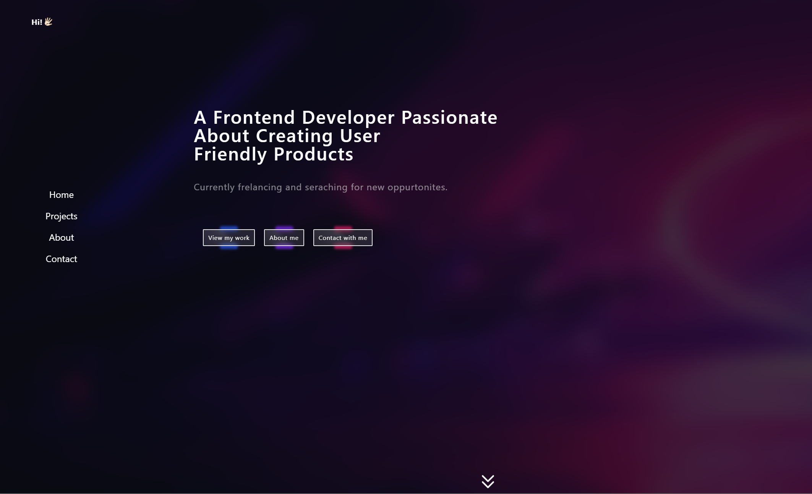

# Portfolio made with React and TailwindCSS

[](https://app.netlify.com/sites/portfoliobp/deploys) [](https://portfoliobp.netlify.app/)

<br/>
<!-- TABLE OF CONTENTS -->
<details open="open">
  <summary>Table of Contents</summary>
  <ol>
    <li>
      <a href="#about-the-project">About The Project</a>
      <ul>
        <li><a href="#built-with">Built With</a></li>
      </ul>
    </li>
    <li>
      <a href="#getting-started">Getting Started</a>
      <ul>
        <li><a href="#prerequisites">Prerequisites</a></li>
        <li><a href="#installation">Installation</a></li>
      </ul>
    </li>
    <li><a href="#demo">Demo</a></li>
    <li><a href="#contact">Contact</a></li>
  </ol>
</details>

<!-- ABOUT THE PROJECT -->

## About The Project

<br>
<p align="center">
<a href="https://portfoliobp.netlify.com" target="_blank"> </a>
</p>
<br>

The application was built with React and TailwindCSS. It presents my personal projects that I have done. A little inforamtion about me, who I am and what I'm doing. Also you can contact with me if you want to colborate on projects, learning togeter or let me make you future website.

### Built With

Application was built with:

-   [React](https://reactjs.org/)
-   [TailwindCSS](https://tailwindcss.com/)
-   [EmailJS](https://www.emailjs.com/)
-   [react-i18next](https://react.i18next.com/)
-   [AOS](https://michalsnik.github.io/aos/)

<!-- GETTING STARTED -->

## Getting Started

Follow the instructions bellow to start the project on your own machine.

### Prerequisites

-   Basic knowledge of React
-   Basic knowledge of TailwindCSS

### Installation

1. Get a free accout on [EmailJS](https://www.emailjs.com/) for secret keys (Only if you would like to send emails via contact form!).
2. Clone the repo
    ```sh
    git clone https://github.com/Simply-man/unsplash-gallery.git
    ```
3. Install NPM packages
    ```sh
    npm install
    ```
4. Create file `.env` in you main directory (Only if you would like to send emails via contact form!)
5. Enter your SECRET KEYS in `.env` (Only if you would like to send emails via contact form!)
    ```JS
    const REACT_APP_SERVICE_ID = 'ENTER YOUR SERVICE KEY FROM EMAILJS';
    const REACT_APP_TEMPLATE_ID = 'ENTER YOUR TEMPLATE KEY FROM EMAILJS';
    const REACT_APP_USER_ID = 'ENTER YOUR USER KEY FROM EMAILJS';
    ```

<!-- USAGE EXAMPLES -->

## Demo

_Check the application in the real world [Demo](https://portfoliobp.netlify.com)_

<!-- CONTACT -->

## Contact

Bartłomiej Popiołek - [@Linkedin](https://www.linkedin.com/in/bart%C5%82omiej-popio%C5%82ek-6394981b2/) - popiolekbartlomiej369@gmail.com

Project Link: [@Github](https://github.com/Simply-man/Portfolio)
